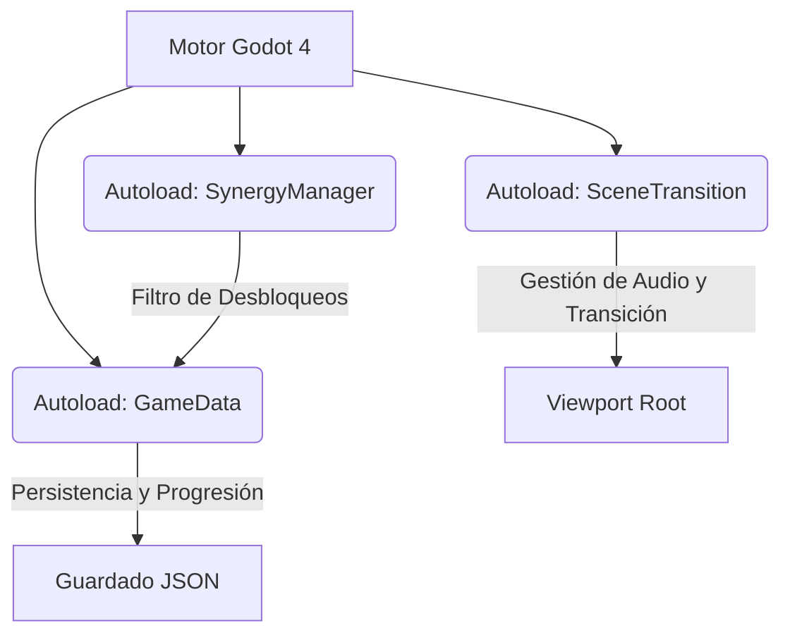
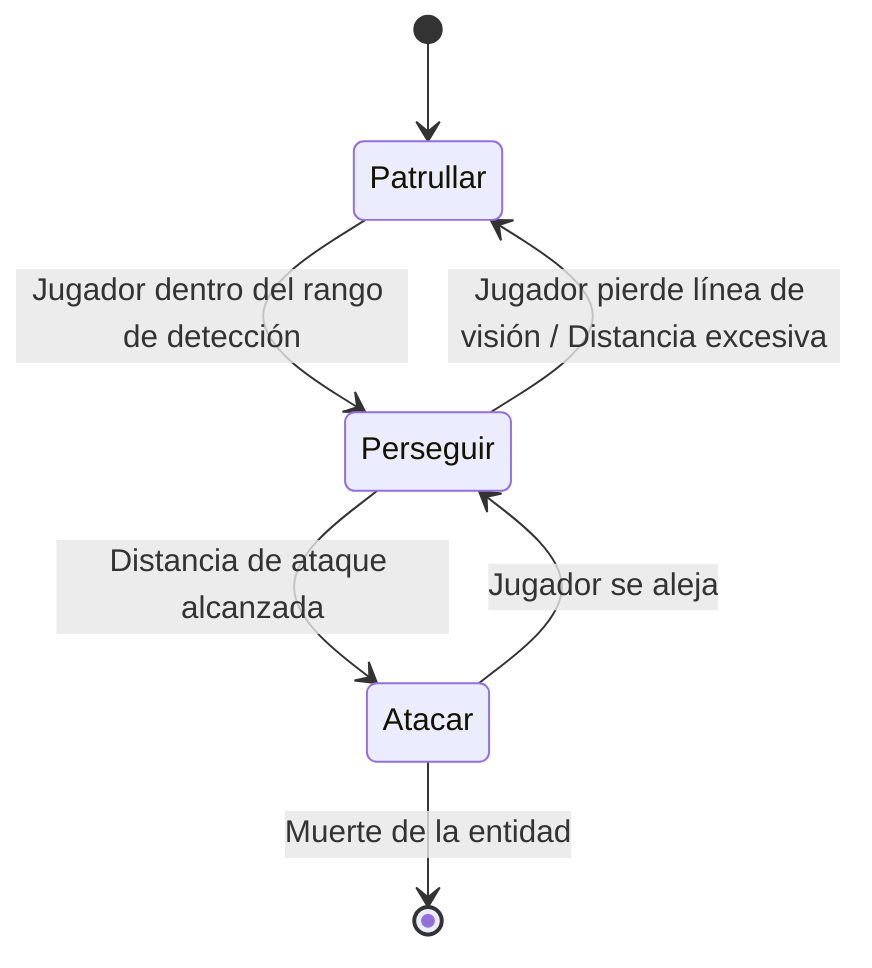

# Documento de Especificación Técnica: Proyecto Lázaro

Este documento detalla exhaustivamente la arquitectura técnica, las mecánicas de juego implementadas, la estructura de la base de datos persistente y los subsistemas lógicos de **Proyecto Lázaro**, un videojuego del género *action roguelike* bidimensional en vista superior desarrollado sobre el motor **Godot 4** usando **GDScript**.

---

## 1. Arquitectura del Motor y Flujo General

El juego opera bajo un paradigma basado en escenas y nodos coordinados mediante directivas de programación orientada a eventos (señales) y controladores globales de acceso universal (*Autoloads*).

### Jerarquía de Capas (Render Layering)
*   **Layer 0-10**: Escenarios, capas de mapa de mosaico (*TileMaps*), decoración del entorno y obstáculos físicos.
*   **Layer 20**: Entidades dinámicas (el Jugador, enemigos y proyectiles).
*   **Layer 30**: Efectos visuales de partículas y destellos de daño.
*   **Layer 100**: Interfaz gráfica del usuario (HUD, inventarios flotantes y menús).
*   **Layer 120**: Pantallas de transición global y fundidos de escena gestionados por `SceneTransition`.

---

## 2. Controladores Globales (Singletons / Autoloads)

El motor de ejecución inicializa tres singletons persistentes al arrancar el proceso del juego:

### A. GameData (`game_data.gd`)
Actúa como el núcleo central del estado del juego y la persistencia de datos. Sus responsabilidades incluyen:
1.  **Monedas persistentes y volátiles**:
    *   `scrap` (Chatarra): Persiste entre partidas y muertes. Modificado por la mejora pasiva de *Compactador*.
    *   `flesh` (Carne): Se reinicia a `0` al inicio de cada run. Se consume en la tienda de Ygor.
2.  **Sistema de Guardado Serializado (JSON)**:
    *   Almacena las estadísticas de mejoras permanentes de la nave, armas iniciales, sinergias compradas (`unlocked_synergies`), historial de runs (`total_deployments`), y récord de salas completadas (`max_reached_room`).
    *   Genera archivos formateados en la ruta virtual del sistema: `user://save_slot_[1-3].json` y `user://global_settings.json`.
3.  **Algoritmo de Generación de Salas e Incremento de Dificultad**:
    *   Determina el tipo de sala siguiente evaluando el índice `current_run_room`.
    *   Las salas de combate comunes se extraen aleatoriamente de un repositorio (`rooms_pool`) evitando repeticiones contiguas.
    *   Aplica fórmulas dinámicas de escalado a partir de la tercera sala:
        $$\text{Enemigos Totales} = 11 + (\text{Sala} - 3) \times 4$$
        $$\text{Concurrentes Máximos} = 5 + \lfloor(\text{Sala} - 3) / 2.0\rfloor$$
        $$\text{Intervalo de Spawn} = \max(0.3, 1.1 - (\text{Sala} - 3) \times 0.05)$$
    *   Habilita tipos de enemigos avanzados progresivamente: *Shooter* y *Tank* desde la sala 2, *Turret* en la sala 4, e *Summoner* en la sala 5.

### B. SynergyManager (`synergy_manager.gd`)
Estructura y calcula dinámicamente si los objetos equipados y el arma activa producen combinaciones especiales.
*   **Encapsulado de Datos**: Declara los requisitos de equipamiento exactos para activar las 6 sinergias existentes.
*   **Filtro de Desbloqueo Comercial**: Evalúa `GameData.is_synergy_unlocked(syn_id)` antes de conceder cualquier beneficio. Si un jugador porta los tres ítems requeridos pero no ha desbloqueado la sinergia en la tienda, el sistema deniega los modificadores estadísticos y los reemplazos de escena.

### C. SceneTransition (`scene_transition.gd`)
Gestor del ciclo de cambio de escenas y ambientación acústica.
*   **Fundido Analógico**: Controla un `ColorRect` de pantalla completa. Ejecuta interpolaciones lineales de opacidad (*Tweens*) en el canal alfa del color para transicionar a negro en un intervalo exacto de `0.5s` e inhabilita las pulsaciones de ratón sobre botones del juego cambiando la directiva `mouse_filter`.
*   **Ruteo de Música Dinámica**: Detiene y reproduce los flujos de audio (`mainmenu_music` y `combat_music`) analizando el nombre de archivo de la escena activa. Silencia la música en zonas seguras como la tienda de Ygor o el laboratorio.

---

## 3. Físicas e Interacciones del Jugador (`player.gd`)

El script principal del jugador hereda de `CharacterBody2D`, gestionando las colisiones físicas a través del motor físico integrado de Godot.

### Movimiento y Dash
*   **Desplazamiento Vectorial**: Procesa la dirección en `_physics_process(delta)` sumando la entrada analógica de las teclas WASD, normalizando el vector resultante y multiplicándolo por la estadística calculada de velocidad de movimiento.
*   **Maniobra de Evasión (Dash)**:
    *   Al activarse, establece un estado temporal de invulnerabilidad que previene la aplicación de daño por colisión directa con proyectiles o áreas nocivas.
    *   Consume energía de la barra de estamina del HUD.
    *   Si está activa la sinergia *Impulso Ligero* con carga cinética al 100%, el dash invoca un impacto radial que genera daño a enemigos y aplica fuerzas de empuje (*Knockback*).
    *   Si está activo el protocolo *Reflejo Sintético*, instancia una copia holográfica del jugador que efectúa un disparo antes de desvanecerse.

### Estructura de Apuntado y Rotación de Armas
Las armas se acoplan a un nodo marcador en la muñeca del personaje.
*   Calcula el ángulo de rotación determinando el vector de dirección desde la posición global del jugador hasta las coordenadas del cursor del ratón en el Viewport (`get_global_mouse_position()`).
*   Aplica `global_rotation = dir.angle()`. Invierte la escala vertical de la escena del arma (`scale.y = -1` o `1`) cuando la mira cruza el plano vertical medio para evitar que el sprite del arma se dibuje de cabeza.

### Cámara Aim Drift (Estilo Enter the Gungeon)
Para dotar al juego de un apuntado táctico y dinámico, la cámara calcula un desplazamiento de deriva hacia el cursor:
1.  **Cálculo de Desplazamiento**: Determina el vector de distancia entre el jugador y el ratón. Multiplica este vector por un coeficiente de influencia de mira (`0.18`), limitándolo mediante `clamp()` a una distancia máxima de `120.0` píxeles para evitar que el jugador pierda visibilidad de su propio entorno inmediato.
2.  **Interpolación Suave de Deriva**:
    *   Usa una fórmula de decaimiento exponencial independiente de los FPS para realizar la interpolación del vector posicional de la cámara:
        $$\vec{P}_{\text{cam}} = \vec{P}_{\text{cam}} + (\vec{P}_{\text{target}} - \vec{P}_{\text{cam}}) \times (1.0 - e^{-7.0 \times \Delta t})$$
    *   Esto garantiza un seguimiento orgánico y libre de tirones incluso con variaciones de rendimiento.
3.  **Desacoplamiento de Vibración**: El offset del efecto de sacudida de pantalla (*Screen Shake*) se calcula como un vector aditivo independiente aplicado a la propiedad `offset` de la cámara, previniendo conflictos algebraicos con el sistema de deriva.

### Shaders y Efectos Dinámicos
*   **Flash de Daño**: Aplica programáticamente un `ShaderMaterial` al sprite del personaje al ser impactado. El shader interpola linealmente el color del pixel original a un rojo puro guiado por un parámetro uniforme de intensidad (`intensity`), animado mediante un `Tween` de `0.1s` de duración.
*   **Filtro de Sinergias (Blur)**: Cuando se activa una sinergia por primera vez, el pop-up añade una capa ColorRect de pantalla completa con un shader que lee la textura de pantalla (`hint_screen_texture`) en escala de mipmaps lineal, aplicando un difuminado difuso radial mediante `textureLod` combinado con una reducción exponencial de la luminancia en fragmento.

---

## 4. Combate y Sistema de Armas

### Rango vs Cuerpo a Cuerpo
El inventario separa de forma estricta las estadísticas de armas a distancia (primarias) y armas de contacto (secundarias):
*   **Armas Rango (Pistola, UZI, Escopeta)**: Generan proyectiles físicos de tipo `Area2D` con formas de colisión circulares o rectangulares. Procesan parámetros como velocidad de salida, dispersión angular (cono de precisión aleatorio en radianes), tiempo de vida útil del proyectil y penetración de objetivos (*Piercing*).
*   **Armas Cuerpo a Cuerpo (Daga, Hacha, Maza)**: Generan un área de colisión de arco. Al presionar el botón de ataque secundario, despliegan un sprite rotatorio que detecta colisiones de cuerpos en su rango, infligiendo daño físico instantáneo y empuje de vectores radiales inversos al punto del impacto.

### Dispersión de Texto de Daño (Scatter)
Para prevenir el apilamiento visual de los números flotantes cuando se efectúan impactos rápidos (por ejemplo, con la UZI o abejas teledirigidas), el texto de daño aplica una física de dispersión lateral:
*   Genera un vector aleatorio horizontal:
    $$V_x = \text{randf\_range}(15.0, 40.0) \times \text{signo\_aleatorio}()$$
*   Genera un vector aleatorio vertical de elevación:
    $$V_y = -\text{randf\_range}(45.0, 60.0)$$
*   Interpola la posición del texto hacia este vector objetivo usando una curva de atenuación cuadrática en el transcurso de `0.8s` mientras reduce su opacidad a cero.

---

## 5. Clasificación Técnica de Sinergias

| ID de Sinergia | Nombre en Juego | Requisitos de Ítems | Comportamiento Lógico Modificado |
| :--- | :--- | :--- | :--- |
| `pistola_mente_colmena` | Mente Colmena | Pistol + Colmena + Cerebro + Cabeza Humana | Reemplaza la pistola por abejas teledirigidas que rastrean enemigos mediante conos de detección y un raycast predictivo. |
| `roadkill` | Roadkill | Pistol + Motocicleta + Sierra + Pulmones | Reemplaza el proyectil por sierras rebotadoras que calculan el vector normal del obstáculo físico en colisión para desviar su trayectoria. |
| `bestia_de_caza` | Instinto Canino | Torso Espinado + Brazo Armado + Piernas Caninas | Inhabilita las armas de rango. Otorga doble empuñadura de armas melee. Activa estado de furia al realizar un dash. |
| `trituradora_biomecanica`| Impulso Ligero | Torso Ligero + Piernas Rodantes + Brazo Ligero | Acumula carga cinética al caminar. Al 100% de carga, el dash libera una onda de choque radial e invulnerabilidad por 0.5s. |
| `acorazado_muscular` | Set Musculoso | Torso Blindado + Brazo Reforzado + Piernas Biónicas | Incrementa un 20% el daño, 15% el knockback y 25% la vida máxima del jugador, reduciendo su velocidad global un 5%. |
| `minigun` | Minigun | Uzi + Mezcladora + Motocicleta + Sierra | Sustituye el arma por una ametralladora rotatoria que incrementa progresivamente su cadencia de disparo (RPM) mientras se mantenga presionada. |

---

## 6. Lógica de Inteligencia Artificial (Enemigos)

Todos los enemigos del juego extienden de `enemy_base.gd`, compartiendo comportamientos troncales a través de máquinas de estados simplificadas.

### Generación de Enemigos Élite
Al instanciar un enemigo en la sala de combate, el motor evalúa si este muta a una versión Élite:
1.  **Cálculo de Probabilidad**: Consulta el nivel de la mejora permanente de la nave *Escáner de Objetivos*:
    $$P_{\text{elite}} = \text{nivel\_escaner} \times 0.03$$
2.  **Mutación de Atributos**: Si el número aleatorio es inferior a la probabilidad calculada:
    *   Escala las dimensiones físicas del nodo del enemigo en un factor de `1.35x`.
    *   Aplica una modulación de color púrpura neón al sprite.
    *   Incrementa la salud máxima en un factor de `2.0x`.
    *   Aumenta el daño de contacto o proyectil en un factor de `1.5x`.
    *   Multiplica la cantidad de chatarra liberada al morir.

---

## 7. Tiendas, Menús y Terminales de Interacción

### NPC Ygor y Diálogos Flotantes
*   Ubicado en la sala de paz.
*   Su lógica no bloquea la navegación del juego. En lugar de desplegar una interfaz de pantalla completa que detenga el tiempo físico, Ygor detecta la cercanía del jugador mediante un nodo `Area2D` y muestra cajas de texto flotantes tipo cómic por encima del NPC, permitiendo al jugador seguir moviéndose libremente por la sala.

### Terminal de Mejoras (Chatarra)
*   **Inyección Dinámica de Scripts**: Al entrar en el Laboratorio, el script de lógica comercial [npc_chatarra.gd](file:///c:/Users/Uriel/Documents/GitHub/proyecto-lazaro/Scripts/NPC/npc_chatarra.gd) se inyecta dinámicamente sobre la entidad física de la terminal mediante `set_script()`. Para poder procesar las pulsaciones del teclado mientras el script se adjunta en tiempo de ejecución, el motor invoca explícitamente `set_process_input(true)` sobre el nodo.
*   **Arquitectura de UI Dinámica**: La interfaz de mejoras se construye programáticamente instanciando nodos de control de Godot (`PanelContainer`, `Button`, `VBoxContainer`). Las compras se controlan asociando funciones de compra con lambdas conectadas a las señales `pressed` de cada botón, pasando argumentos concretos del coste y el identificador de la mejora.

### Rotación de Etiquetas de Puertas
*   Para asegurar que la señal interactiva "Presiona E" de las puertas de paso permanezca legible cuando el nodo de la puerta se rota en el editor a 90° o 180°, la etiqueta se desacopla del ángulo de rotación de su nodo padre.
*   El script [door.gd](file:///c:/Users/Uriel/Documents/GitHub/proyecto-lazaro/Scripts/World/door.gd) busca en primer lugar el nodo hijo `"Label"` existente en la escena de la puerta. Si no se encuentra, lo crea dinámicamente como mecanismo de respaldo.
*   El script establece la propiedad `top_level` de la etiqueta en `true` (nodo independiente de la jerarquía visual de transformaciones). Esto desvincula las coordenadas de la etiqueta de las transformaciones del padre (anulando cualquier rotación, escala o volteo). Durante el ciclo `_process(_delta)`, simplemente se reposiciona de manera absoluta en el espacio global a `60px` por encima del centro de la puerta, asegurando su visualización horizontal constante.

---

## 8. Escena de Depuración y Sandbox (`debug_scene.gd`)

La escena de depuración sirve como entorno de pruebas aislado para validar mecánicas y forzar estados de juego:
*   **Retorno de Estado y Regreso Fiel**: Al iniciar el sandbox presionando la tecla **F6**, el sistema captura la ruta de la escena activa y la almacena en `GameData.previous_scene_path`. Al presionar el botón "Regresar" o la tecla de retorno, el motor carga de nuevo exactamente la sala en la que se encontraba el jugador con su equipamiento intacto.
*   **Panel Colapsable Lateral**: El panel de botones del sandbox utiliza un contenedor de interfaz gráfica posicionado en el extremo derecho de la pantalla. Para ocultar y mostrar la interfaz, un interpolador de movimiento cambia la propiedad `position.x` de todo el contenedor, permitiendo un deslizamiento suave al hacer clic en el botón de la pestaña.
